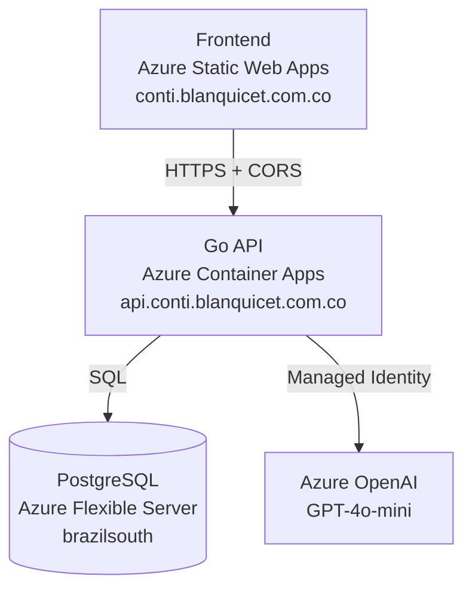

# Conti

> Personal and family finance app focused on shared expenses, debt clarity, and financial transparency.

## What is Conti?

Conti is a web application designed to make money management between people simple, transparent, and calm. It helps you:

- Track shared expenses with family and friends
- Understand who owes whom (and how much)
- Manage household finances with budgets and categories
- Split costs fairly across multiple people
- Automate recurring expenses (rent, utilities, subscriptions)
- Chat with an AI assistant about your finances

The app emphasizes **clarity over complexity** and **trust over cleverness**.

## Architecture



| Component | Technology | Hosting |
|-----------|-----------|---------|
| **Frontend** | Vanilla HTML/CSS/JavaScript (ES6 modules, mobile-first) | Azure Static Web Apps (CDN) |
| **Backend** | Go with pgx driver | Azure Container Apps |
| **Database** | PostgreSQL 16 | Azure Flexible Server |
| **AI Chat** | GPT-4o-mini | Azure OpenAI (Managed Identity) |
| **Auth** | Session-based with HttpOnly cookies | — |
| **IaC** | Terraform | Azure Storage (remote state) |
| **CI/CD** | GitHub Actions | — |

## Features

### Implemented

- **Household Management** — Members, contacts, payment methods, bank accounts
- **Movement Registration** — HOUSEHOLD, SPLIT, and DEBT_PAYMENT movement types
- **Expense Dashboard** — 3-level hierarchical view (Groups → Categories → Movements)
- **Income Tracking** — Per-member income with account allocation
- **Budget Management** — Monthly budgets per category with inheritance
- **Loans View** — 3-level drill-down showing who owes whom
- **Recurring Movements** — Templates with auto-generation (monthly/yearly schedules)
- **Credit Card Tracking** — Statement periods, payment tracking, installments
- **Audit Logging** — Complete audit trail for all CRUD operations
- **AI Chat** — Financial assistant powered by GPT-4o-mini with tool use
- **Email Notifications** — Password reset via Resend

### Coming Soon

- Debt settlement ("Saldar") integration
- Template editing from UI
- Mobile app (PWA)

## Project Structure

```
├── frontend/          # Vanilla HTML/CSS/JavaScript (mobile-first SPA)
│   ├── pages/         # Route-based page modules (lazy-loaded)
│   ├── components/    # Reusable UI components
│   └── styles.css     # Global styles
├── backend/           # Go API server
│   ├── cmd/api/       # Entry point
│   ├── internal/      # Domain packages (movements, income, budgets, etc.)
│   └── migrations/    # PostgreSQL migrations (033+)
├── infra/             # Terraform for Azure infrastructure
├── docs/              # Design docs (10 phases)
└── .github/           # CI/CD workflows
```

## Getting Started

For local development setup, see [docs/DEVELOPMENT.md](docs/DEVELOPMENT.md).

## Documentation

- **[FUTURE_VISION.md](FUTURE_VISION.md)** — Product vision and roadmap
- **[docs/design/](docs/design/)** — Phase-by-phase design documents
- **[infra/README.md](infra/README.md)** — Infrastructure and deployment guide

## Philosophy

- **Clarity over complexity** — Simple, understandable interfaces
- **Trust over cleverness** — Transparent data, no hidden logic
- **Calm over control** — Non-invasive, no pressure
- **Insight over micromanagement** — Show what matters, hide the noise

---

**Made with ☕ by [Jose](https://github.com/blanquicet)**
