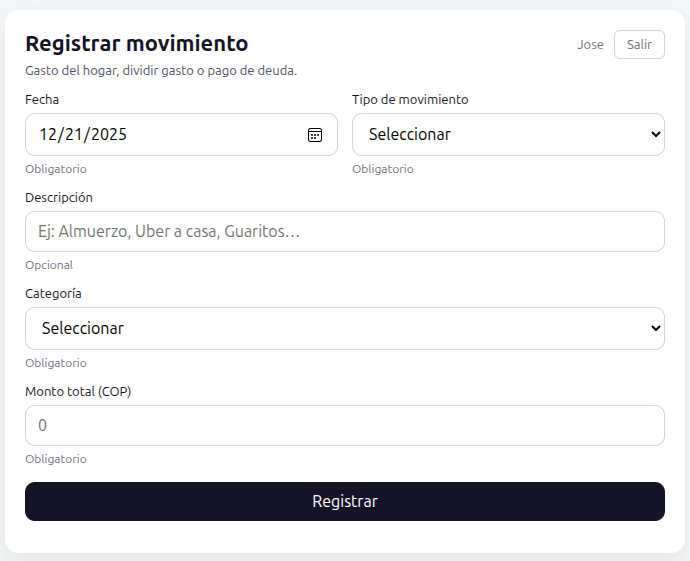
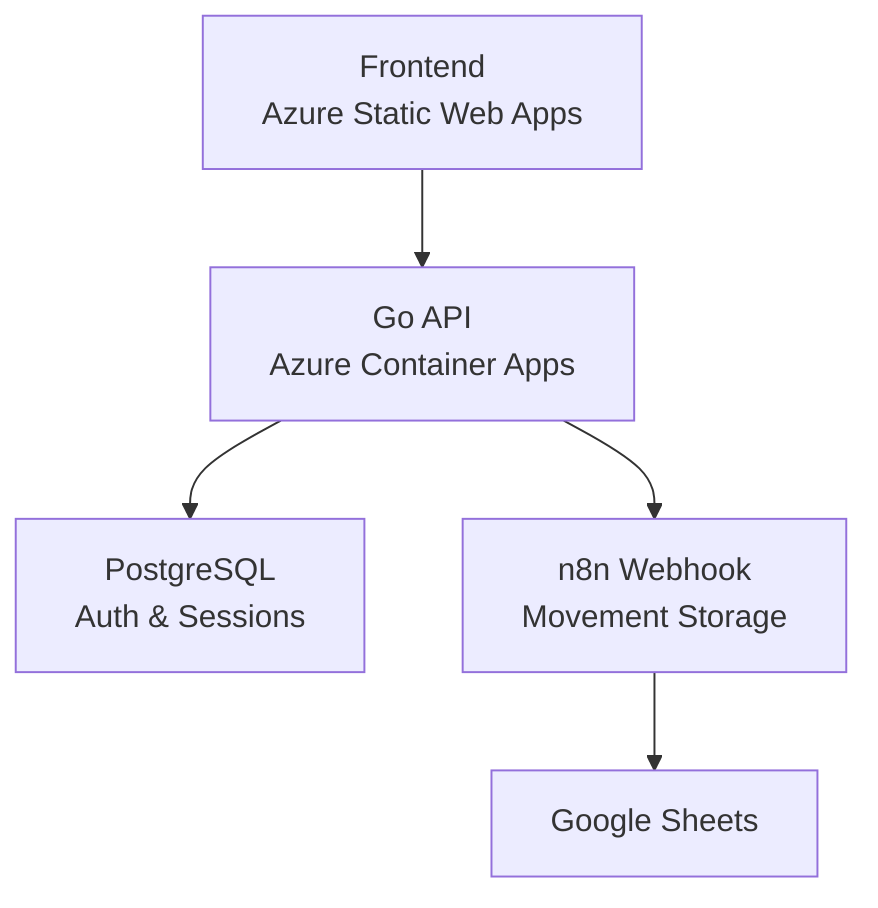

# Gastos

> Personal and family finance app focused on shared expenses, debt clarity, and financial transparency.

**⚠️ In Active Development** — This project is currently under active development. Features and architecture are evolving rapidly.

## What is Gastos?

Gastos is a web application designed to make money management between people simple, transparent, and calm. It helps you:

- Track shared expenses with family and friends
- Understand who owes whom (and how much)
- Manage household finances with clarity
- Split costs fairly across multiple people
- Plan events and settle debts easily

The app emphasizes **clarity over complexity** and **trust over cleverness**.

## Preview

### Movement Registration

Simple and clean interface for recording expenses and payments:

  

## Vision

The long-term vision is to build a comprehensive personal finance tool that answers questions like:

- "How much did we spend on this trip?"
- "Can I afford to pay my credit card this month?"
- "Who still owes me money?"
- "Where did our money go last month?"

See [FUTURE_VISION.md](FUTURE_VISION.md) for the complete product roadmap and philosophy.

## Philosophy

This app is guided by core principles:

- **Clarity over complexity** — Simple, understandable interfaces
- **Trust over cleverness** — Transparent data, no hidden logic
- **Calm over control** — Non-invasive notifications, no pressure
- **Insight over micromanagement** — Show what matters, hide the noise

Money between people should be simple, transparent, and calm.

## Current Status

**Phase 0: Movement Registration** ✅ Active

- Movement entry via web form
- Integration with n8n webhook backend
- Data stored in Google Sheets

**Phase 1: Authentication** ✅ Complete

- Session-based authentication with PostgreSQL
- User registration, login, password reset (backend ready, missing frontend)
- Go backend API deployed on Azure

**Next: Phase 2** ⏳ Planned

- Implement families and external contacts
- Migrate movements from Google Sheets to PostgreSQL, integrated with Go API

## Architecture

See [docs/design/](docs/design/) for detailed phase documentation.

## Getting Started

For local development setup, see [docs/DEVELOPMENT.md](docs/DEVELOPMENT.md).

## Documentation

- **[FUTURE_VISION.md](FUTURE_VISION.md)** — Product vision, philosophy, and long-term roadmap
- **[docs/design/](docs/design/)** — Phase-by-phase implementation documentation
  - [00_N8N_PHASE.md](docs/design/00_N8N_PHASE.md) — Movement registration (current)
  - [01_AUTH_PHASE.md](docs/design/01_AUTH_PHASE.md) — Authentication system (complete)
- **[docs/DEVELOPMENT.md](docs/DEVELOPMENT.md)** — Local development setup guide
- **[infra/README.md](infra/README.md)** — Infrastructure and deployment guide

## Tech Stack

- **Frontend:** Vanilla HTML/CSS/JavaScript (mobile-first)
- **Backend:** Go with PostgreSQL (pgx driver)
- **Auth:** Session-based with HttpOnly cookies
- **Deployment:** Azure (Static Web Apps + Container Apps + PostgreSQL)
- **IaC:** Terraform
- **CI/CD:** GitHub Actions

## License

MIT License — See [LICENSE](LICENSE) for details.

## Contributing

This is a personal project in active development. The codebase and architecture are evolving as new phases are implemented.

If you're interested in the project or have suggestions, feel free to open an issue for discussion.

---

**Made with ☕ by [Jose](https://github.com/blanquicet)**
