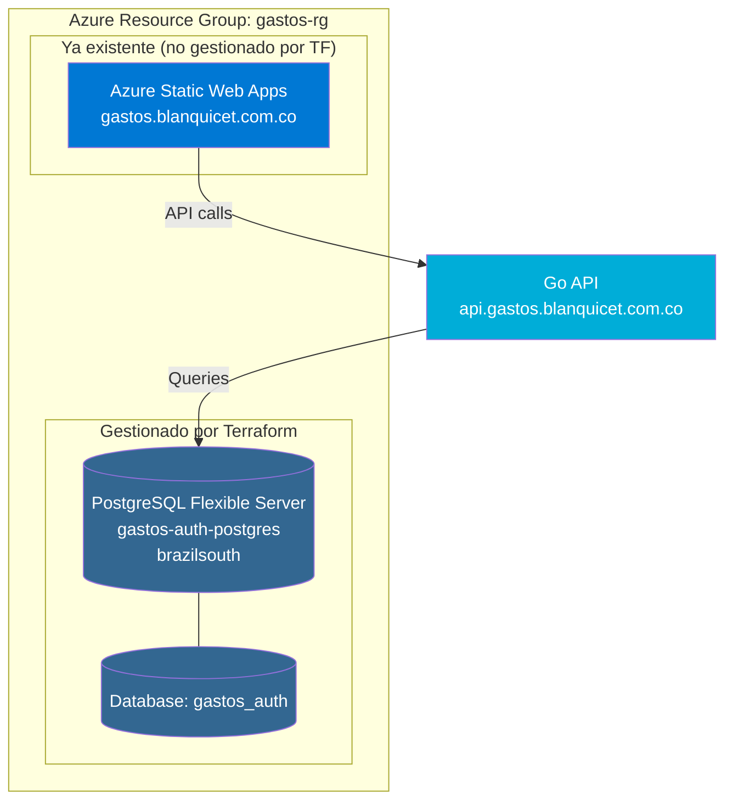

# Infraestructura - Conti App

Esta carpeta contiene la configuración de **Terraform** para crear y gestionar los recursos de Azure de la aplicación Gastos.

---

## ¿Qué es Terraform?

Terraform es una herramienta de **Infraestructura como Código (IaC)**. En lugar de crear recursos manualmente en el portal de Azure, los defines en archivos de texto (`.tf`) y Terraform los crea automáticamente.

### Ventajas

| Sin Terraform | Con Terraform |
| ------------- | ------------- |
| Clics manuales en Azure Portal | Comandos automatizados |
| "¿Cómo creé esto?" | El código documenta todo |
| Difícil de replicar | `terraform apply` recrea todo |
| Propenso a errores | Consistente y repetible |

---

## Arquitectura actual



---

## Archivos en esta carpeta

| Archivo | Propósito |
| ------- | --------- |
| `main.tf` | Define los recursos de Azure (PostgreSQL, firewall, etc.) |
| `variables.tf` | Variables configurables con defaults (nombres, SKUs, etc.) |
| `outputs.tf` | Valores de salida (connection strings, IPs, etc.) |
| `.gitignore` | Evita commitear secrets y estado local |

---

## Flujo de trabajo de Terraform


### Comandos principales

| Comando | Qué hace |
| ------- | -------- |
| `terraform init` | Inicializa el proyecto, descarga providers de Azure |
| `terraform plan` | Muestra qué cambios se harán (sin ejecutar nada) |
| `terraform apply` | Crea/modifica los recursos en Azure |
| `terraform destroy` | **¡CUIDADO!** Elimina todos los recursos gestionados |
| `terraform output` | Muestra los valores de salida (ej: connection string) |

---

## Guía paso a paso

### Prerrequisitos

1. **Azure CLI** instalado y autenticado
2. **Terraform** instalado (v1.5+)

```bash
# Verificar instalaciones
az --version
terraform --version
```

### Autenticación en Azure

#### Datos de la cuenta Azure

| Parámetro | Valor |
| --------- | ----- |
| **Tenant ID** | `9de9ca20-a74e-40c6-9df8-61b9e313a5b3` |
| **Subscription ID** | `0f6b14e8-ade9-4dc5-9ef9-d0bcbaf5f0d8` |
| **Subscription Name** | Visual Studio Enterprise Subscription |
| **Resource Group** | `gastos-rg` |
| **RG Region** | `westus2` |
| **PostgreSQL Region** | `brazilsouth` (por restricciones de cuota) |

#### Login manual (desarrollo local)

```bash
# Login con tenant específico (abre navegador)
az login --tenant 9de9ca20-a74e-40c6-9df8-61b9e313a5b3

# Verificar que estás en la suscripción correcta
az account show --query "{name:name, id:id, tenantId:tenantId}"

# Si necesitas cambiar de suscripción
az account set --subscription "0f6b14e8-ade9-4dc5-9ef9-d0bcbaf5f0d8"
```

### Paso 1: Inicializar Terraform

Todos los valores tienen defaults en `variables.tf`, así que no necesitas crear ningún archivo adicional.

```bash
cd /ruta/a/gastos/infra
terraform init
```

#### (Opcional) Añadir tu IP para desarrollo local

Si quieres conectarte a PostgreSQL desde tu máquina, crea `terraform.tfvars`:

```hcl
# Obtener tu IP: curl -s ifconfig.me
dev_ip_address = "TU_IP_AQUI"
```

> ⚠️ **Importante**: El CI/CD borra esta regla en cada push a main
>
> Como `terraform.tfvars` no está en el repo (contiene secretos), cada vez que GitHub Actions ejecuta `terraform apply`, la variable `dev_ip_address` está vacía y Terraform elimina la regla de firewall.
>
> **Después de cada push a main**, recupera tu acceso ejecutando:
>
> ```bash
> terraform apply -var="dev_ip_address=$(curl -s ifconfig.me)" -target=azurerm_postgresql_flexible_server_firewall_rule.dev_ip -auto-approve
> ```

### Paso 2: Ver el plan

```bash
terraform plan
```

Esto muestra **qué recursos se van a crear** sin crear nada. Revisa que todo se vea correcto.

Salida esperada:

```text
Plan: 6 to add, 0 to change, 0 to destroy.
```

### Paso 3: Aplicar (crear recursos)

```bash
terraform apply -auto-approve
```

⏱️ **Tiempo estimado**: 5-10 minutos (PostgreSQL tarda en crearse)

### Paso 4: Obtener el connection string

```bash
# Ver todos los outputs
terraform output

# Solo el DATABASE_URL (para usar en el backend)
terraform output -raw database_url
```

---

## Recursos que crea Terraform


### Detalles del servidor PostgreSQL

| Propiedad | Valor |
| --------- | ----- |
| **SKU** | B_Standard_B1ms (Burstable) |
| **vCores** | 1 |
| **RAM** | 2 GB |
| **Storage** | 32 GB |
| **Versión** | PostgreSQL 16 |
| **Backup** | 7 días retención |
| **Región** | `brazilsouth` |
| **SSL** | Requerido |
| **Costo estimado** | ~$12-15/mes |

---

## Estado de Terraform (terraform.tfstate)

Terraform guarda un archivo `terraform.tfstate` que recuerda qué recursos ha creado.

⚠️ **IMPORTANTE**: Este archivo contiene secrets (contraseñas). Por eso está en `.gitignore`.


### ¿Qué pasa si pierdo el tfstate?

Terraform no sabrá qué recursos existen. Opciones:

1. `terraform import` para re-importar recursos existentes
2. Recrear desde cero (peligroso si hay datos)

Para producción real, se recomienda guardar el estado en un backend remoto (Azure Storage, etc.).

---

## Comandos útiles

### Ver el connection string

```bash
terraform output -raw database_url
```

### Conectarse con psql

```bash
psql "$(terraform output -raw database_url)"
```

### Ver la contraseña del admin

```bash
terraform output -raw postgres_admin_password
```

### Actualizar tu IP de desarrollo

1. Edita `terraform.tfvars` con tu nueva IP
2. Ejecuta:

```bash
terraform apply -auto-approve
```

### Destruir todo (¡CUIDADO!)

```bash
terraform destroy
```

Esto elimina el servidor PostgreSQL y todos los datos. Terraform te pedirá confirmación.

---

## Troubleshooting

### Error: "Subscription not found"

```bash
# Verificar que estás logueado
az login

# Listar suscripciones
az account list --output table

# Cambiar a la suscripción correcta
az account set --subscription "0f6b14e8-ade9-4dc5-9ef9-d0bcbaf5f0d8"
```

### Error: "Server name already exists"

El nombre del servidor PostgreSQL debe ser único globalmente. Cambia el default en `variables.tf` o usa `-var`:

```bash
terraform apply -var="postgres_server_name=gastos-auth-nuevo"
```

### Error: "Cannot connect to database"

1. Verifica que tu IP está en las reglas de firewall
2. Verifica que estás usando SSL (`sslmode=require`)

```bash
# Actualizar tu IP
curl -s ifconfig.me  # Copia esta IP
# Edita terraform.tfvars con la nueva IP
terraform apply
```

---

## Próximos pasos

Después de crear el PostgreSQL:

1. **Guardar DATABASE_URL** como secret para el backend
2. **Ejecutar migrations** para crear las tablas de auth (ver [documentación de migraciones](../backend/migrations/README.md))
3. **Desplegar el backend Go** que usará esta base de datos

```bash
# Exportar para uso local
export DATABASE_URL="$(terraform output -raw database_url)"

# Ejecutar migrations
cd ../backend
migrate -path ./migrations -database "$DATABASE_URL" up
```

---

## GitHub Actions (CI/CD)

El workflow de Terraform está configurado en `.github/workflows/terraform.yml`.

### Estado actual

| Componente | Estado |
| ---------- | ------ |
| Service Principal | ✅ `github-actions-gastos` |
| `ARM_CLIENT_ID` | ✅ Configurado en GitHub |
| `ARM_CLIENT_SECRET` | ✅ Configurado en GitHub |
| `ARM_SUBSCRIPTION_ID` | ✅ Configurado en GitHub |
| `ARM_TENANT_ID` | ✅ Configurado en GitHub |
| Workflow | ✅ `.github/workflows/terraform.yml` |

### Comportamiento del workflow

| Evento | Acción |
| ------ | ------ |
| **PR** con cambios en `infra/` | Ejecuta `terraform plan` y comenta el resultado |
| **Push a main** con cambios en `infra/` | Ejecuta `terraform apply` automáticamente |

### Reconfigurar (si es necesario)

Si necesitas recrear el Service Principal o reconfigurar los secrets:

```bash
cd infra/scripts
./setup-github-actions.sh
```

Este script:

1. Crea el Service Principal en Azure
2. Muestra los valores de los secrets
3. (Opcional) Configura los secrets en GitHub automáticamente si tienes `gh` CLI

### Setup manual

Si prefieres hacerlo manualmente:

#### Crear Service Principal

```bash
# Crear el Service Principal con permisos de Contributor en la suscripción
az ad sp create-for-rbac \
  --name "github-actions-gastos" \
  --role Contributor \
  --scopes /subscriptions/0f6b14e8-ade9-4dc5-9ef9-d0bcbaf5f0d8 \
  --sdk-auth
```

Este comando devuelve un JSON con los secrets. **Guárdalos, solo se muestran una vez.**

### Secrets necesarios en GitHub

Using the GitHub CLI (recommended):

```bash
gh secret set ARM_CLIENT_ID --body "<appId del JSON>"
gh secret set ARM_CLIENT_SECRET --body "<password del JSON>"
gh secret set ARM_SUBSCRIPTION_ID --body "0f6b14e8-ade9-4dc5-9ef9-d0bcbaf5f0d8"
gh secret set ARM_TENANT_ID --body "9de9ca20-a74e-40c6-9df8-61b9e313a5b3"
```

Or manually via web UI:
Ir a: Repository → Settings → Secrets and variables → Actions → New repository secret

| Secret Name | Valor | Descripción |
| ----------- | ----- | ----------- |
| `ARM_CLIENT_ID` | `appId` del JSON | ID de la aplicación |
| `ARM_CLIENT_SECRET` | `password` del JSON | Contraseña del SP |
| `ARM_SUBSCRIPTION_ID` | `0f6b14e8-ade9-4dc5-9ef9-d0bcbaf5f0d8` | ID de suscripción |
| `ARM_TENANT_ID` | `9de9ca20-a74e-40c6-9df8-61b9e313a5b3` | ID del tenant |

### Flujo de autenticación


### Ejemplo de workflow (referencia futura)

```yaml
# .github/workflows/terraform.yml
name: Terraform

on:
  push:
    paths:
      - 'infra/**'
    branches:
      - main
  pull_request:
    paths:
      - 'infra/**'

env:
  ARM_CLIENT_ID: ${{ secrets.ARM_CLIENT_ID }}
  ARM_CLIENT_SECRET: ${{ secrets.ARM_CLIENT_SECRET }}
  ARM_SUBSCRIPTION_ID: ${{ secrets.ARM_SUBSCRIPTION_ID }}
  ARM_TENANT_ID: ${{ secrets.ARM_TENANT_ID }}

jobs:
  terraform:
    runs-on: ubuntu-latest
    defaults:
      run:
        working-directory: infra

    steps:
      - uses: actions/checkout@v4

      - name: Setup Terraform
        uses: hashicorp/setup-terraform@v3
        with:
          terraform_version: 1.5.7

      - name: Terraform Init
        run: terraform init

      - name: Terraform Plan
        run: terraform plan -no-color -out=tfplan

      - name: Terraform Apply
        run: terraform apply -auto-approve tfplan
        if: github.ref == 'refs/heads/main' && github.event_name == 'push'
```

> **Nota**: El workflow completo está en `.github/workflows/terraform.yml` e incluye comentarios en PRs y validación de formato.

### Estado remoto

El estado de Terraform se almacena en Azure Storage, permitiendo:

- Compartir estado entre desarrolladores
- GitHub Actions puede acceder al estado
- Backup automático

| Componente | Estado |
| ---------- | ------ |
| Storage Account | ✅ `gastostfstate` |
| Container | ✅ `tfstate` |
| Backend en main.tf | ✅ Configurado |

#### Reconfigurar estado remoto (si es necesario)

```bash
cd infra/scripts
./setup-remote-state.sh
```

---

## Resumen de valores Azure

| Recurso | Valor |
| ------- | ----- |
| **GitHub Repo** | `blanquicet/gastos` |
| **Tenant ID** | `9de9ca20-a74e-40c6-9df8-61b9e313a5b3` |
| **Subscription ID** | `0f6b14e8-ade9-4dc5-9ef9-d0bcbaf5f0d8` |
| **Subscription Name** | Visual Studio Enterprise Subscription |
| **Resource Group** | `gastos-rg` |
| **RG Region** | `westus2` |
| **PostgreSQL Server** | `gastos-auth-postgres` |
| **PostgreSQL Region** | `brazilsouth` |
| **PostgreSQL FQDN** | `gastos-auth-postgres.postgres.database.azure.com` |
| **PostgreSQL Database** | `gastos_auth` |
| **PostgreSQL Admin** | `gastosadmin` |
| **PostgreSQL Version** | 16 |
| **TF State Storage** | `gastostfstate` |

---

## Container Apps (Backend API)

El backend Go se despliega en **Azure Container Apps**, un servicio serverless para contenedores.

### Recursos creados por Terraform

| Recurso | Nombre | Propósito |
| ------- | ------ | --------- |
| Log Analytics Workspace | `conti-api-logs` | Logs y monitoreo |
| Container App Environment | `conti-api-env` | Entorno de ejecución |
| Container App | `conti-api` | La aplicación Go (con Managed Identity) |
| Azure OpenAI | `conti-openai` | Modelo GPT-4.1-mini para chat financiero |
| OpenAI Chat Deployment | `gpt-4.1-mini` | Deployment del modelo de chat |
| OpenAI Embeddings Deployment | `text-embedding-3-small` | (Opcional) Deployment de embeddings |
| RBAC Role Assignment | — | "Cognitive Services OpenAI User" para Container App → OpenAI |

### Configuración

- **Image**: `ghcr.io/blanquicet/gastos/api:latest` (público)
- **CPU/Memory**: 0.25 vCPU / 0.5 Gi
- **Scale**: 0-2 replicas (escala a 0 cuando no hay tráfico)
- **Ingress**: HTTPS externo en puerto 8080

### Azure OpenAI (Chat Financiero)

El Container App se conecta a Azure OpenAI usando **Managed Identity** (sin API keys):

| Variable de entorno | Origen | Descripción |
| ------------------- | ------ | ----------- |
| `AZURE_OPENAI_ENDPOINT` | Output de `azurerm_cognitive_account` | Endpoint URL del recurso OpenAI |
| `AZURE_OPENAI_CHAT_DEPLOYMENT` | `var.azure_openai_chat_deployment` | Nombre del deployment del chat (default: gpt-4.1-mini) |
| `AZURE_OPENAI_API_VERSION` | `var.azure_openai_api_version` | Versión de la API (default: 2024-10-21) |
| `AZURE_OPENAI_EMBEDDINGS_DEPLOYMENT` | `var.azure_openai_embeddings_deployment` | (Opcional) Deployment de embeddings |

**GitHub Variables** (no Secrets, configurar en Settings > Variables > Actions):

| Variable | Default | Descripción |
| -------- | ------- | ----------- |
| `AZURE_OPENAI_CHAT_DEPLOYMENT` | `gpt-4.1-mini` | Nombre del deployment |
| `AZURE_OPENAI_API_VERSION` | `2024-10-21` | Versión de la API de Azure OpenAI |
| `AZURE_OPENAI_LOCATION` | `eastus` | Región para el recurso de OpenAI |
| `AZURE_OPENAI_EMBEDDINGS_DEPLOYMENT` | `text-embedding-3-small` | Deployment de embeddings |

### URLs

| Tipo | URL |
| ---- | --- |
| Default Azure | `https://conti-api.happytree-8a8e768b.westus2.azurecontainerapps.io` |
| Custom Domain | `https://api.gastos.blanquicet.com.co` |

---

## Custom Domain Setup (Cloudflare + Azure)

Para configurar un custom domain en Container Apps con certificado SSL gratuito:

### Paso 1: Agregar registros DNS en Cloudflare

Agrega estos registros en Cloudflare para `blanquicet.com.co`:

| Type | Name | Content | Proxy |
| ---- | ---- | ------- | ----- |
| CNAME | `api.gastos` | `conti-api.happytree-8a8e768b.westus2.azurecontainerapps.io` | **DNS only** (nube gris) |
| TXT | `asuid.api.gastos` | `0CD2548528D10CDD6B09A5598CD441F5D60B7C8E60684BD84B0655BFE8B8A25E` | - |

> **Importante**: El proxy de Cloudflare DEBE estar deshabilitado (DNS only) para que Azure pueda validar el dominio y emitir el certificado.

### Paso 2: Agregar hostname en Azure

```bash
# Agregar el hostname
az containerapp hostname add \
  --name conti-api \
  --resource-group gastos-rg \
  --hostname api.gastos.blanquicet.com.co

# Vincular con certificado SSL managed (gratuito)
az containerapp hostname bind \
  --name conti-api \
  --resource-group gastos-rg \
  --hostname api.gastos.blanquicet.com.co \
  --environment conti-api-env \
  --validation-method CNAME
```

### Paso 3: Verificar estado

```bash
# Ver hostnames configurados
az containerapp hostname list \
  --name conti-api \
  --resource-group gastos-rg \
  -o table

# Ver estado del certificado
az containerapp env certificate list \
  --name conti-api-env \
  --resource-group gastos-rg \
  --query "[].{name:name, subject:properties.subjectName, state:properties.provisioningState}" \
  -o table
```

Estados del certificado:

- `Pending`: Azure está validando DNS y generando el certificado (puede tomar varios minutos)
- `Succeeded`: Certificado listo, HTTPS funcionando
- `Failed`: Verificar que los registros DNS estén correctos

### Paso 4: Probar

```bash
curl https://api.gastos.blanquicet.com.co/health
# {"status":"healthy"}
```

---

## Costos estimados

| Recurso | Costo/mes |
| ------- | --------- |
| PostgreSQL B1ms | ~$15 |
| Container Apps (scale-to-zero) | ~$0-5 |
| Azure OpenAI (GPT-4o-mini) | ~$0.05 |
| Log Analytics | ~$2-3 |
| Static Web Apps | Gratis |
| GHCR (público) | Gratis |
| **Total estimado** | **~$20-25** |
